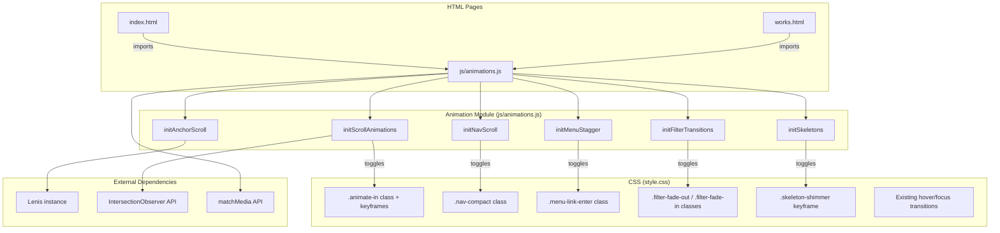

# Design Document: UI Transition Animations

## Overview

This design adds a cohesive animation layer to the portfolio site, covering scroll-triggered entrances, navigation state transitions, mobile menu animations, filter/view transitions, hover micro-interactions, and loading skeletons. The implementation follows the existing architecture: CSS classes define all animations in `style.css`, and a single lightweight JS module (`js/animations.js`) orchestrates class toggling via IntersectionObserver and event listeners.

The system integrates with the existing Lenis smooth scroll, view-transition theme toggle, and page fade transitions without conflict. All animations respect `prefers-reduced-motion: reduce` via the existing global CSS override rule and a JS-side check that skips orchestration logic entirely.

### Design Decisions

1. **Single animation module** — All animation orchestration lives in one ES module (`js/animations.js`) imported by both `index.html` and `works.html`. This keeps the 2KB budget manageable and avoids scattered inline scripts.

2. **CSS-first animations** — All visual transitions are defined as CSS classes/keyframes. JS only adds/removes classes and sets `--stagger-delay` custom properties. This ensures GPU-composited rendering (transform + opacity only) and makes reduced-motion handling trivial via the existing media query.

3. **IntersectionObserver for scroll triggers** — One observer instance handles all section entrances. Elements are marked with `data-animate` attributes in HTML; the observer adds `.is-visible` when threshold is met. No scroll event listeners needed.

4. **Stagger via CSS custom property** — Instead of setting inline `animation-delay` per element, JS sets `--stagger-index` on each child. CSS uses `calc(var(--stagger-index) * var(--stagger-base))` for the delay. This keeps animation logic in CSS and makes the JS minimal.

5. **Lenis integration for anchor scrolling** — Anchor clicks call `lenis.scrollTo(target, { offset, duration, easing })` instead of native `scrollIntoView`. This preserves the heavy-momentum feel and allows coordination with entrance animations.

## Architecture



## Components and Interfaces

### 1. Animation Module (`js/animations.js`)

The single entry point for all animation orchestration. Exported as an ES module.

```javascript
// Public API
export function initAnimations(lenisInstance: Lenis): void;

// Internal functions (not exported)
function initScrollAnimations(): void;
function initNavScroll(): void;
function initMenuStagger(): void;
function initFilterTransitions(): void;
function initSkeletons(): void;
function initAnchorScroll(lenis: Lenis): void;
function computeStaggerDelays(children: Element[], baseDelay: number, maxCount: number): number[];
function isReducedMotion(): boolean;
```

**`initAnimations(lenisInstance)`** — Called once on DOMContentLoaded. Checks `isReducedMotion()` first; if true, marks all `[data-animate]` elements as immediately visible and returns early (skipping observer setup). Otherwise, initializes all sub-systems.

**`computeStaggerDelays(children, baseDelay, maxCount)`** — Pure function. Given an array of child elements, a base delay in ms, and a maximum stagger count, returns an array of delay values. Children beyond `maxCount` receive the same delay as the last staggered child (i.e., they all animate together at the cap).

**`isReducedMotion()`** — Returns `window.matchMedia('(prefers-reduced-motion: reduce)').matches`.

### 2. Scroll Animation System (`initScrollAnimations`)

- Creates a single `IntersectionObserver` with `{ threshold: 0.15, rootMargin: '0px 0px -80px 0px' }`.
- Observes all elements with `[data-animate]` attribute.
- On intersection: adds `.is-visible` class, sets `--stagger-index` on children marked with `[data-animate-child]`, then `unobserve()`s the element.
- On page load: any element already intersecting gets `.is-visible` immediately without transition (via `.no-transition` class applied and removed in the next frame).

### 3. Navigation Scroll System (`initNavScroll`)

- Uses a scroll event listener (throttled via `requestAnimationFrame`) on the Lenis scroll callback or a passive scroll listener.
- When `scrollY > 50`: adds `.nav-compact` to `nav.site-nav`.
- When `scrollY <= 50`: removes `.nav-compact`.
- CSS handles the transition (padding and background changes).

### 4. Mobile Menu Stagger (`initMenuStagger`)

- Listens for the `.open` class being added to `.mobile-nav-overlay` (via MutationObserver on class attribute, or by wrapping the existing hamburger click handler).
- When menu opens: sets `--stagger-index` on each `.mobile-nav-link` and adds `.menu-link-enter` class.
- When menu closes: removes `.menu-link-enter` from all links.
- Interruption handling: if menu state changes mid-animation, CSS `transition` property naturally handles reversal since we're using transitions (not keyframe animations) for the menu container.

### 5. Filter Transition System (`initFilterTransitions`)

- Wraps the existing `loadProjects()` filter logic.
- On filter change:
  1. Adds `.filter-fade-out` to all current cards (opacity 1→0, 200ms).
  2. After 200ms (via `transitionend` or timeout fallback): calls the existing render function.
  3. Adds `.filter-fade-in` to new cards with stagger delays.
  4. Removes animation classes after completion.
- Interruption: if filter changes during animation, clears any pending timeouts and restarts the sequence.

### 6. Skeleton Loading System (`initSkeletons`)

- Before Firebase data loads, skeleton HTML is already in the DOM (replacing the current "CONNECTING..." text).
- Skeletons use `.skeleton-shimmer` class with a CSS gradient animation.
- When data arrives: adds `.skeleton-exit` (fade out 200ms), then replaces with real content that gets `.filter-fade-in` stagger treatment.
- 8-second timeout: if content hasn't loaded, removes skeletons and shows error message.

### 7. Anchor Scroll System (`initAnchorScroll`)

- Intercepts clicks on `a[href^="#"]` links.
- Validates target element exists via `document.getElementById()`.
- Calls `lenis.scrollTo(target, { offset: -navHeight, duration: 2.0, easing: exponentialOut })`.
- After scroll completes (Lenis `onComplete` callback): triggers entrance animation on target if not already animated.
- User interruption: Lenis natively cancels programmatic scroll on user input (wheel/touch).

## Data Models

### HTML Data Attributes

| Attribute | Applied To | Purpose |
|-----------|-----------|---------|
| `data-animate` | Section containers | Marks element for scroll-triggered entrance |
| `data-animate-child` | Children within `[data-animate]` | Marks element for stagger delay |
| `data-skeleton` | Placeholder elements | Identifies skeleton loading elements |

### CSS Custom Properties (New)

| Property | Scope | Default | Purpose |
|----------|-------|---------|---------|
| `--stagger-index` | `[data-animate-child]` | `0` | Index for stagger delay calculation |
| `--stagger-base` | `.is-visible` context | `80ms` | Base delay between staggered items |
| `--animate-duration` | `.animate-in` | `500ms` | Section entrance animation duration |

### CSS Classes (New)

| Class | Purpose |
|-------|---------|
| `.is-visible` | Applied when section enters viewport; triggers entrance animation |
| `.no-transition` | Temporarily disables transitions for elements visible on load |
| `.nav-compact` | Compact navigation state (scrolled past 50px) |
| `.menu-link-enter` | Staggered fade-in for mobile menu links |
| `.filter-fade-out` | Fade-out animation for cards being filtered away |
| `.filter-fade-in` | Fade-in animation for newly filtered cards |
| `.skeleton-shimmer` | Shimmer gradient animation on loading placeholders |
| `.skeleton-exit` | Fade-out for skeleton elements when content loads |

### Animation Keyframes (New)

| Keyframe | Properties | Duration | Easing |
|----------|-----------|----------|--------|
| `sectionEnter` | opacity 0→1, translateY 30px→0 | 500ms | cubic-bezier(0.22, 1, 0.36, 1) |
| `shimmer` | background-position -200% → 200% | 1.8s | linear, infinite |
| `viewFadeIn` | (existing) opacity 0→1, blur 4px→0, translateY 8px→0 | 400ms | cubic-bezier(0.16, 1, 0.3, 1) |

## Correctness Properties

*A property is a characteristic or behavior that should hold true across all valid executions of a system — essentially, a formal statement about what the system should do. Properties serve as the bridge between human-readable specifications and machine-verifiable correctness guarantees.*

### Property 1: Stagger delay computation correctness

*For any* array of N child elements (where N ≥ 0), a base delay value between 50ms and 100ms, and a maximum stagger count between 1 and 20, the `computeStaggerDelays` function SHALL return an array of length N where: each element at index i (for i < maxCount) equals `i * baseDelay`, and each element at index i (for i ≥ maxCount) equals `(maxCount - 1) * baseDelay`.

**Validates: Requirements 1.2, 4.2, 6.2, 7.1**

### Property 2: Filter selection correctness

*For any* set of project cards with randomly assigned type values and any selected filter category, the set of cards receiving the fade-out class SHALL be exactly those cards whose type does not match the selected filter (when filter is not "ALL"), and SHALL be the empty set when filter is "ALL".

**Validates: Requirements 4.1**

## Error Handling

| Scenario | Handling |
|----------|----------|
| IntersectionObserver not supported | Skip scroll animations; all sections display immediately at full opacity |
| Lenis instance not available | Fall back to native `scrollIntoView({ behavior: 'smooth' })` for anchor links |
| Firebase load timeout (8s) | Remove skeleton placeholders, display inline error message |
| `matchMedia` not supported | Assume reduced motion is false (animations play normally) |
| `[data-animate]` element has no children | Apply entrance animation to the element itself without stagger |
| Filter change during animation | Clear pending timeouts, cancel in-progress transitions via class removal, restart sequence |
| Hash target doesn't exist | No-op; leave viewport position unchanged |

## Testing Strategy

### Unit Tests (Example-Based)

Unit tests cover specific scenarios and integration points:

- **Scroll observer setup**: Verify observer is created with correct threshold (0.15) and rootMargin
- **Nav compact toggle**: Verify `.nav-compact` is added at scrollY > 50 and removed at ≤ 50
- **Menu stagger**: Verify link elements get correct `--stagger-index` values when menu opens
- **Reduced motion bypass**: Verify all `[data-animate]` elements get `.is-visible` immediately when reduced motion is active
- **Once-only animation**: Verify observer unobserves element after first intersection
- **Elements visible on load**: Verify elements already in viewport get `.is-visible` without transition
- **Skeleton timeout**: Verify skeletons are removed and error shown after 8 seconds
- **Invalid hash**: Verify no scroll action for non-existent targets
- **Animation cleanup**: Verify animation classes and inline styles are removed after view toggle completes

### Property-Based Tests

Property tests verify universal correctness across all inputs:

- **Stagger delay computation** (Property 1): Generate random child counts (0–50), random base delays (50–100ms), random max counts (1–20). Verify output array length equals input length, values follow the formula, and cap is respected. Minimum 100 iterations.
  - Tag: **Feature: ui-transition-animations, Property 1: Stagger delay computation correctness**

- **Filter selection** (Property 2): Generate random card sets (1–30 cards) with random types from ["Game", "3D Model", "Web", "Software"], apply random filter values. Verify correct partition into fade-out vs. keep sets. Minimum 100 iterations.
  - Tag: **Feature: ui-transition-animations, Property 2: Filter selection correctness**

### PBT Library

Use **fast-check** (npm package `fast-check`) for property-based testing, as it's the standard PBT library for JavaScript and works well with the existing Node.js test infrastructure.

### Integration / Manual Tests

- Visual regression: Verify animations look correct across Chrome, Firefox, Safari
- Performance: Use Chrome DevTools Performance panel to verify no frames exceed 16ms
- Accessibility: Test with `prefers-reduced-motion: reduce` enabled in OS settings
- Mobile: Test hamburger menu stagger on real devices (iOS Safari, Android Chrome)
- File size: Verify `js/animations.js` minified is under 2KB

### Test Configuration

- Property tests: minimum 100 iterations per property
- Test runner: Vitest (or any ES module-compatible runner)
- No browser required for property tests (pure function testing)
- Integration tests require browser environment (Playwright or manual)
